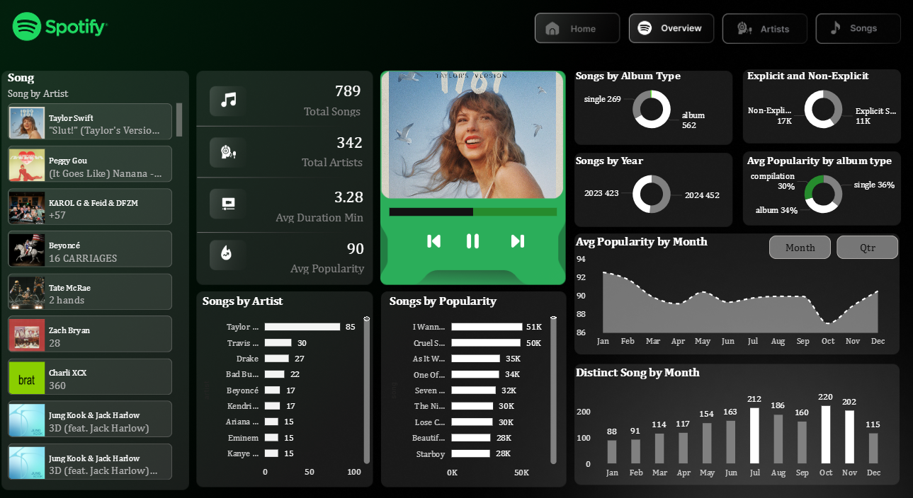
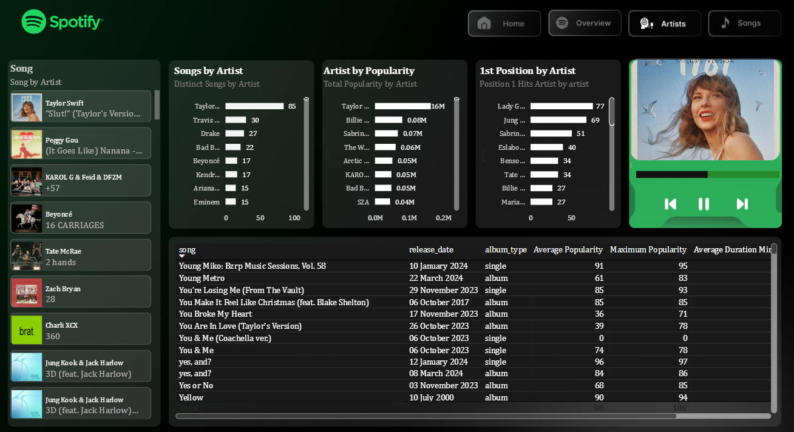
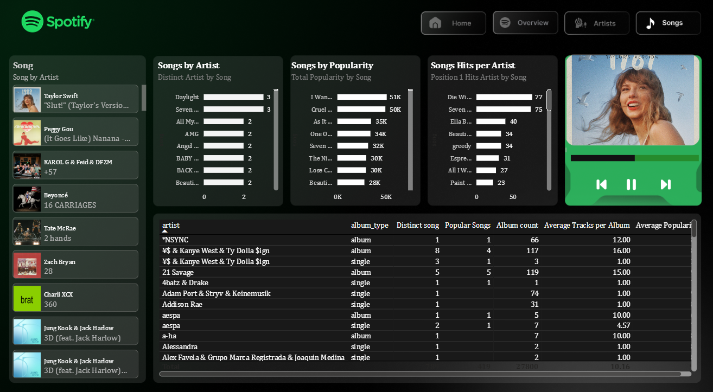

# 🎵 Spotify Top 50 World Music Analytics

### Interactive Music Analytics Dashboard | Power BI • DAX • Data Visualization

> An interactive Power BI analytics project built around Spotify Top 50 music data, combining data analysis, DAX calculations, chart ranking analysis, artist performance, popularity trends, explicit content analysis, song duration and album insights into an executive-style dashboard.

---

## 📌 Project Overview

This project analyzes **Spotify Top 50 music data** using Microsoft Power BI to understand song popularity, artist performance, chart rankings and music trends.

The dashboard transforms raw Spotify chart data into an interactive analytical report that helps answer key questions such as:

1. 🎵 Which songs and artists perform best on the Spotify charts?
2. 🏆 How frequently do songs appear in the Top 10, Top 20 and Top 50?
3. ⭐ What is the average popularity of songs and artists?
4. 👨‍🎤 Which artists have the strongest chart performance?
5. 🔞 What percentage of songs are explicit?
6. ⏱️ What is the average duration of songs?
7. 💿 What type of albums are represented in the dataset?
8. 📅 What release and chart trends can be observed over time?

The final Power BI dashboard combines **song performance, artist analysis, popularity, ranking, duration and release trends** into an interactive music analytics experience.

---

# 📊 Executive Snapshot

| Metric | Description |
|---|---|
| 🎵 Total Songs | Total unique songs available in the dataset |
| 👨‍🎤 Total Artists | Total unique artists |
| ⭐ Average Popularity | Average Spotify popularity score |
| 🏆 Best Position | Highest chart position achieved |
| 📉 Worst Position | Lowest chart position recorded |
| 🥇 Position 1 Hits | Number of #1 chart appearances |
| 🔞 Explicit Song % | Percentage of explicit songs |
| ⏱️ Avg Duration | Average song duration in minutes |

---

# 🗂️ Dataset

The dataset contains Spotify Top 50 chart and song-level information.

### Dataset Columns

| Column | Description |
|---|---|
| `date` | Chart date |
| `position` | Song's chart position |
| `song` | Song name |
| `artist` | Artist name |
| `popularity` | Spotify popularity score |
| `duration_ms` | Song duration in milliseconds |
| `album_type` | Album type |
| `total_tracks` | Number of tracks in the album |
| `release_date` | Song/album release date |
| `is_explicit` | Indicates whether the song contains explicit content |
| `album_cover_url` | URL of the album cover |

---

# 🖥️ Power BI Dashboard

The Power BI report is designed as an interactive music analytics dashboard.

## 1️⃣ Overview Dashboard 🎵

**Business objective:**  
Provide a high-level overview of Spotify Top 50 music performance.

### Key KPIs

- 🎵 Total Songs
- 👨‍🎤 Total Artists
- ⭐ Average Popularity
- 🏆 Best Position
- 📉 Worst Position
- 🥇 Position 1 Hits
- 🔞 Explicit Song %
- ⏱️ Average Song Duration

### Main Analysis

- Top songs by popularity
- Top artists by chart appearances
- Chart position distribution
- Explicit vs non-explicit songs
- Song duration analysis
- Album type distribution

---

## 2️⃣ Artist Analysis 👨‍🎤

**Business objective:**  
Analyze artist performance across the Spotify Top 50 charts.

### Key Analysis

- Top artists by number of appearances
- Artists with the most Top 10 appearances
- Artists with the most #1 hits
- Average popularity by artist
- Best chart position achieved by each artist
- Number of songs represented by each artist

### Artist Performance Metrics

The dashboard helps analyze artists based on:

- Chart presence
- Popularity scores
- Top 10 appearances
- Number of songs
- Best chart position

---

## 3️⃣ Song Analysis 🎵

**Business objective:**  
Analyze individual songs based on popularity, ranking and other attributes.

### Key Analysis

- Top songs by popularity
- Top songs by chart position
- Top 10 songs
- Top 20 songs
- #1 songs
- Song duration
- Explicit content
- Album information

---

# 4️⃣ Popularity Analysis ⭐

Spotify popularity scores are analyzed to understand the distribution of songs across different popularity levels.

### Popularity Categories

| Popularity Score | Category |
|---:|---|
| 80+ | 🔥 Highly Popular |
| 60–79 | ⭐ Popular |
| 40–59 | 🟡 Moderate |
| Below 40 | 🔵 Low |

This classification helps compare songs across different popularity levels.

---

# 5️⃣ Chart Ranking Analysis 🏆

The dashboard analyzes how songs perform across chart positions.

### Ranking Metrics

- Position 1 Hits
- Top 10 Appearances
- Top 20 Appearances
- Songs in Top 10
- Songs in Top 20
- Songs in Top 50
- Best Position
- Worst Position
- Average Position

---

# 6️⃣ Explicit Content Analysis 🔞

The dashboard compares explicit and non-explicit songs.

### Analysis Includes

- Number of explicit songs
- Number of non-explicit songs
- Explicit song percentage
- Non-explicit song percentage
- Average popularity of explicit songs
- Average popularity of non-explicit songs

---

# 7️⃣ Song Duration Analysis ⏱️

Song duration is originally stored in milliseconds and converted into minutes for easier interpretation.

### Metrics

- Average duration
- Minimum duration
- Maximum duration
- Median duration

---

# 8️⃣ Album Analysis 💿

The dashboard analyzes album-related information.

### Metrics

- Average tracks per album
- Maximum tracks per album
- Minimum tracks per album
- Album type count

---

# 9️⃣ Date & Release Analysis 📅

The dataset contains both chart dates and release dates.

### Chart Analysis

- First chart date
- Latest chart date
- Chart year
- Chart month

### Release Analysis

- First release date
- Latest release date
- Release year
- Release month

This allows analysis of music trends over time.

---

# 📐 Core DAX Measures

## 🎵 Total Songs

```DAX
Total Songs =
DISTINCTCOUNT('Top-50-World'[song])
```

---

## 👨‍🎤 Total Artists

```DAX
Total Artists =
DISTINCTCOUNT('Top-50-World'[artist])
```

---

## ⭐ Average Popularity

```DAX
Average Popularity =
AVERAGE('Top-50-World'[popularity])
```

---

## ⭐ Maximum Popularity

```DAX
Maximum Popularity =
MAX('Top-50-World'[popularity])
```

---

## 📉 Minimum Popularity

```DAX
Minimum Popularity =
MIN('Top-50-World'[popularity])
```

---

## 📊 Average Chart Position

```DAX
Average Position =
AVERAGE('Top-50-World'[position])
```

---

## 🏆 Best Chart Position

```DAX
Best Position =
MIN('Top-50-World'[position])
```

---

## 📉 Worst Chart Position

```DAX
Worst Position =
MAX('Top-50-World'[position])
```

---

# 🏆 Chart Ranking Measures

## 🥇 Position 1 Hits

```DAX
Position 1 Hits =
CALCULATE(
    COUNTROWS('Top-50-World'),
    'Top-50-World'[position] = 1
)
```

---

## 🔝 Top 10 Appearances

```DAX
Top 10 Appearances =
CALCULATE(
    COUNTROWS('Top-50-World'),
    'Top-50-World'[position] <= 10
)
```

---

## 🔝 Top 20 Appearances

```DAX
Top 20 Appearances =
CALCULATE(
    COUNTROWS('Top-50-World'),
    'Top-50-World'[position] <= 20
)
```

---

## 🎵 Songs in Top 10

```DAX
Songs in Top 10 =
CALCULATE(
    DISTINCTCOUNT('Top-50-World'[song]),
    'Top-50-World'[position] <= 10
)
```

---

## 🎵 Songs in Top 20

```DAX
Songs in Top 20 =
CALCULATE(
    DISTINCTCOUNT('Top-50-World'[song]),
    'Top-50-World'[position] <= 20
)
```

---

## 🎵 Songs in Top 50

```DAX
Songs in Top 50 =
CALCULATE(
    DISTINCTCOUNT('Top-50-World'[song]),
    'Top-50-World'[position] <= 50
)
```

---

# 📈 Percentage Analysis

## 🔝 Top 10 Appearance %

```DAX
Top 10 Appearance % =
DIVIDE(
    [Top 10 Appearances],
    COUNTROWS('Top-50-World'),
    0
)
```

**Format:** Percentage

---

## 🔝 Top 20 Appearance %

```DAX
Top 20 Appearance % =
DIVIDE(
    [Top 20 Appearances],
    COUNTROWS('Top-50-World'),
    0
)
```

**Format:** Percentage

---

## 🎵 Top 10 Song %

```DAX
Top 10 Song % =
DIVIDE(
    [Songs in Top 10],
    [Total Songs],
    0
)
```

**Format:** Percentage

---

## 🎵 Top 20 Song %

```DAX
Top 20 Song % =
DIVIDE(
    [Songs in Top 20],
    [Total Songs],
    0
)
```

**Format:** Percentage

---

# 🔞 Explicit Content Measures

## 🔞 Explicit Songs

```DAX
Explicit Songs =
CALCULATE(
    COUNTROWS('Top-50-World'),
    'Top-50-World'[is_explicit] = TRUE()
)
```

---

## ✅ Non-Explicit Songs

```DAX
Non-Explicit Songs =
CALCULATE(
    COUNTROWS('Top-50-World'),
    'Top-50-World'[is_explicit] = FALSE()
)
```

---

## 🔞 Explicit Song %

```DAX
Explicit Song % =
DIVIDE(
    [Explicit Songs],
    COUNTROWS('Top-50-World'),
    0
)
```

**Format:** Percentage

> ⚠️ Do not multiply by 100 when using Percentage format in Power BI.

---

## ✅ Non-Explicit Song %

```DAX
Non-Explicit Song % =
DIVIDE(
    [Non-Explicit Songs],
    COUNTROWS('Top-50-World'),
    0
)
```

**Format:** Percentage

---

## ⭐ Explicit Average Popularity

```DAX
Explicit Avg Popularity =
CALCULATE(
    AVERAGE('Top-50-World'[popularity]),
    'Top-50-World'[is_explicit] = TRUE()
)
```

---

## ⭐ Non-Explicit Average Popularity

```DAX
Non-Explicit Avg Popularity =
CALCULATE(
    AVERAGE('Top-50-World'[popularity]),
    'Top-50-World'[is_explicit] = FALSE()
)
```

---

# ⏱️ Song Duration Measures

## ⏱️ Average Duration in Milliseconds

```DAX
Average Duration ms =
AVERAGE('Top-50-World'[duration_ms])
```

---

## ⏱️ Average Duration in Minutes

```DAX
Average Duration Minutes =
DIVIDE(
    AVERAGE('Top-50-World'[duration_ms]),
    60000,
    0
)
```

---

## ⏱️ Minimum Duration Minutes

```DAX
Minimum Duration Minutes =
DIVIDE(
    MIN('Top-50-World'[duration_ms]),
    60000,
    0
)
```

---

## ⏱️ Maximum Duration Minutes

```DAX
Maximum Duration Minutes =
DIVIDE(
    MAX('Top-50-World'[duration_ms]),
    60000,
    0
)
```

---

## ⏱️ Median Duration Minutes

```DAX
Median Duration Minutes =
DIVIDE(
    MEDIAN('Top-50-World'[duration_ms]),
    60000,
    0
)
```

---

# 💿 Album Measures

## 💿 Average Tracks per Album

```DAX
Average Tracks per Album =
AVERAGE('Top-50-World'[total_tracks])
```

---

## 💿 Maximum Tracks per Album

```DAX
Maximum Tracks per Album =
MAX('Top-50-World'[total_tracks])
```

---

## 💿 Minimum Tracks per Album

```DAX
Minimum Tracks per Album =
MIN('Top-50-World'[total_tracks])
```

---

## 💿 Album Type Count

```DAX
Album Type Count =
DISTINCTCOUNT('Top-50-World'[album_type])
```

---

# ⭐ Popularity Classification Measures

## 🔥 Highly Popular Songs

```DAX
Highly Popular Songs =
CALCULATE(
    DISTINCTCOUNT('Top-50-World'[song]),
    'Top-50-World'[popularity] >= 80
)
```

---

## ⭐ Popular Songs

```DAX
Popular Songs =
CALCULATE(
    DISTINCTCOUNT('Top-50-World'[song]),
    'Top-50-World'[popularity] >= 60,
    'Top-50-World'[popularity] < 80
)
```

---

## 🟡 Moderate Popularity Songs

```DAX
Moderate Popularity Songs =
CALCULATE(
    DISTINCTCOUNT('Top-50-World'[song]),
    'Top-50-World'[popularity] >= 40,
    'Top-50-World'[popularity] < 60
)
```

---

## 🔵 Low Popularity Songs

```DAX
Low Popularity Songs =
CALCULATE(
    DISTINCTCOUNT('Top-50-World'[song]),
    'Top-50-World'[popularity] < 40
)
```

---

# 👨‍🎤 Artist Performance Measures

## 🎤 Average Songs per Artist

```DAX
Average Songs per Artist =
DIVIDE(
    [Total Songs],
    [Total Artists],
    0
)
```

---

## ⭐ Average Popularity per Artist

```DAX
Average Popularity per Artist =
AVERAGEX(
    VALUES('Top-50-World'[artist]),
    CALCULATE(
        AVERAGE('Top-50-World'[popularity])
    )
)
```

---

## 🏆 Best Artist Position

```DAX
Best Artist Position =
MINX(
    VALUES('Top-50-World'[artist]),
    CALCULATE(
        MIN('Top-50-World'[position])
    )
)
```

---

# 📊 Additional Analytics

## 📋 Total Records

```DAX
Total Records =
COUNTROWS('Top-50-World')
```

---

## 📊 Median Popularity

```DAX
Median Popularity =
MEDIAN('Top-50-World'[popularity])
```

---

# 🖼️ Data Coverage Measures

## 🖼️ Songs with Album Cover

```DAX
Songs with Album Cover =
CALCULATE(
    DISTINCTCOUNT('Top-50-World'[song]),
    NOT ISBLANK('Top-50-World'[album_cover_url])
)
```

---

## 🖼️ Album Cover Availability %

```DAX
Album Cover Availability % =
DIVIDE(
    [Songs with Album Cover],
    [Total Songs],
    0
)
```

**Format:** Percentage

---

## 📅 Songs with Release Date

```DAX
Songs with Release Date =
CALCULATE(
    DISTINCTCOUNT('Top-50-World'[song]),
    NOT ISBLANK('Top-50-World'[release_date])
)
```

---

## 📅 Release Date Availability %

```DAX
Release Date Availability % =
DIVIDE(
    [Songs with Release Date],
    [Total Songs],
    0
)
```

**Format:** Percentage

---

# 📅 Date Analysis

## 📅 First Chart Date

```DAX
First Chart Date =
MIN('Top-50-World'[date])
```

---

## 📅 Latest Chart Date

```DAX
Latest Chart Date =
MAX('Top-50-World'[date])
```

---

## 📅 First Release Date

```DAX
First Release Date =
MIN('Top-50-World'[release_date])
```

---

## 📅 Latest Release Date

```DAX
Latest Release Date =
MAX('Top-50-World'[release_date])
```

---

# 🗓️ Calculated Columns

> ⚠️ These are **Calculated Columns**, not Measures.  
> Create them using **Modeling → New Column**.

## 📅 Chart Year

```DAX
Year =
YEAR('Top-50-World'[date])
```

---

## 📅 Chart Month

```DAX
Month =
FORMAT('Top-50-World'[date], "MMM")
```

---

## 🔢 Month Number

```DAX
Month Number =
MONTH('Top-50-World'[date])
```

---

## 📅 Release Year

```DAX
Release Year =
YEAR('Top-50-World'[release_date])
```

---

## 📅 Release Month

```DAX
Release Month =
FORMAT('Top-50-World'[release_date], "MMM")
```

---

## 🔢 Release Month Number

```DAX
Release Month Number =
MONTH('Top-50-World'[release_date])
```

### 📌 Month Sorting

To display months in chronological order:

**Month → Sort by column → Month Number**

Similarly:

**Release Month → Sort by column → Release Month Number**

---

# 🎨 Dashboard Design

The dashboard follows a **Spotify-inspired dark theme**.

### 🎨 Color Palette

| Element | Color |
|---|---|
| Background | `#121212` |
| Secondary Background | `#181818` |
| Card Background | `#242424` |
| Spotify Green | `#1DB954` |
| Bright Green | `#1ED760` |
| Primary Text | `#FFFFFF` |
| Secondary Text | `#B3B3B3` |
| Border | `#303030` |

### Additional Chart Colors

| Color | Hex Code |
|---|---|
| Purple | `#8B5CF6` |
| Blue | `#3B82F6` |
| Orange | `#F59E0B` |
| Red | `#EF4444` |
| Cyan | `#06B6D4` |

The primary Spotify green is used for important KPIs, highlights and selected elements, while additional colors are used to differentiate analytical categories.

---

# 📊 Dashboard Visualizations

### 📌 KPI Cards

- Total Songs
- Total Artists
- Average Popularity
- Position 1 Hits
- Explicit Song %
- Average Duration

### 📊 Bar Charts

Used for:

- Top Artists
- Top Songs
- Chart Position
- Album Types

### 📈 Line Charts

Used for:

- Chart trends
- Release trends
- Popularity trends

### 🍩 Donut Charts

Used for:

- Explicit vs Non-Explicit
- Album Type
- Popularity Categories

### 🔵 Scatter Plot

Used for:

- Popularity vs Duration
- Popularity vs Chart Position

---

# 🔄 Analytics Workflow

```text
Raw Spotify Dataset
        │
        ▼
Data Cleaning
        │
        ▼
Power Query Transformation
        │
        ▼
Data Modeling
        │
        ▼
DAX Measures & Calculated Columns
        │
        ▼
Data Visualization
        │
        ▼
Interactive Power BI Dashboard
        │
        ▼
Music & Artist Insights
```

---

# 🧹 Data Preparation

The dataset was prepared before visualization.

### Data Preparation Activities

- Removed unnecessary data
- Checked missing values
- Verified column data types
- Converted date columns
- Converted duration from milliseconds to minutes
- Created calculated columns
- Created DAX measures
- Categorized popularity levels
- Organized chart ranking metrics
- Prepared fields for visualization

---

# 💡 Key Business Insights

## 01 · Song Performance 🎵

The dashboard identifies songs with strong popularity scores and strong chart positions, allowing comparison between popularity and actual chart performance.

## 02 · Artist Performance 👨‍🎤

Artist-level analysis helps identify artists with multiple chart appearances and strong average popularity.

## 03 · Chart Ranking 🏆

Top 10, Top 20 and #1 appearances provide a deeper understanding of chart performance rather than looking only at popularity.

## 04 · Explicit Content 🔞

The dashboard compares explicit and non-explicit songs and analyzes their average popularity.

## 05 · Song Duration ⏱️

Duration analysis helps understand the typical length of songs appearing in the Spotify Top 50.

## 06 · Album Analysis 💿

Album type and number of tracks provide additional context about the songs represented in the dataset.

## 07 · Music Trends 📅

Chart dates and release dates enable analysis of music trends across different periods.

---

# 🎯 Project Objectives

The main objectives of this project are:

- Analyze Spotify Top 50 songs
- Identify high-performing artists
- Analyze chart ranking patterns
- Understand popularity distribution
- Compare explicit and non-explicit songs
- Analyze song duration
- Explore album characteristics
- Analyze release trends
- Build an interactive Power BI dashboard
- Demonstrate practical DAX skills
- Convert raw data into meaningful visual insights

---

# 🛠️ Tech Stack

| Area | Technology |
|---|---|
| Data Visualization | **Microsoft Power BI** |
| Data Transformation | **Power Query** |
| Analytics | **DAX** |
| Dashboard Design | **Power BI** |
| Data Analysis | **Power BI** |
| Data Source | **Spotify Top 50 Dataset** |

---

# 📚 Skills Demonstrated

This project demonstrates practical knowledge of:

- 📊 Power BI
- 📐 DAX
- 🔄 Power Query
- 🧹 Data Cleaning
- 🗂️ Data Transformation
- 📈 Data Visualization
- 📊 Data Analysis
- 🎨 Dashboard Design
- 📅 Date Analysis
- 🏆 Ranking Analysis
- 👨‍🎤 Artist Analysis
- 🎵 Music Analytics
- 📋 KPI Development

---

# 🧠 Learning Outcomes

Through this project, I strengthened my understanding of:

- Power BI dashboard development
- DAX measures
- Calculated columns
- Filter context
- `CALCULATE()`
- `DIVIDE()`
- `DISTINCTCOUNT()`
- `AVERAGE()`
- `MEDIAN()`
- `MIN()` and `MAX()`
- `AVERAGEX()`
- Date-based analysis
- Ranking analysis
- KPI design
- Interactive dashboard storytelling
- Business-oriented data visualization

---

# 🚀 Future Improvements

Possible future improvements include:

- 🎧 Add Spotify API integration
- 📅 Add dynamic time intelligence
- 🎤 Add artist profile pages
- 🎵 Add song-level drill-through
- 📈 Add year-over-year popularity analysis
- 🔥 Add popularity trend forecasting
- 🌍 Add country-level Spotify analysis
- 🎼 Add genre-level analysis
- 🔗 Add interactive Spotify song links
- 🤖 Add machine learning-based popularity prediction

---

# 📁 Project Structure

```text
Spotify-Dashboard/
│
├── README.md
├── Spotify_Analysis.pbix
│
├── Dataset/
│   └── spotify-top-50-world.csv
│
├── Screenshorts/
│   ├── Artists.png
│   ├── Index.png
│   ├── Overview.png
│   └── Songs.png
│
└── Documentation/
    └── Project_Documentation.pdf
```

---

# 📸 Dashboard Preview

## 🏠 Dashboard Index


---

## 🎵 Overview Dashboard



---

## 👨‍🎤 Artist Analysis



---

## 🎵 Song Analysis



# 📊 DAX Measure Summary

| Category | Measures |
|---|---:|
| 🎵 Basic KPIs | 8 |
| 🏆 Chart Ranking | 6 |
| 📈 Percentage Analysis | 4 |
| 🔞 Explicit Analysis | 6 |
| ⏱️ Duration Analysis | 5 |
| 💿 Album Analysis | 4 |
| ⭐ Popularity Analysis | 4 |
| 👨‍🎤 Artist Analysis | 3 |
| 📊 Additional Analytics | 2 |
| 🖼️ Data Coverage | 4 |
| 📅 Date Analysis | 4 |
| 🗓️ Calculated Columns | 6 |

---

# 🎯 Project Outcome

This project demonstrates how a raw music dataset can be transformed into an **interactive analytical dashboard** using Power BI and DAX.

The dashboard provides a structured view of:

**Songs → Artists → Popularity → Chart Rankings → Explicit Content → Duration → Albums → Release Trends**

It demonstrates practical data analytics skills while presenting the results through an interactive and visually engaging Power BI dashboard.

---

# ⭐ What This Project Demonstrates

- 📊 Interactive Power BI dashboard development
- 📐 Practical DAX measure creation
- 🧹 Data cleaning and transformation
- 📅 Date and time analysis
- 🏆 Ranking and performance analysis
- 👨‍🎤 Artist-level analytics
- 🎵 Song-level analytics
- ⭐ Popularity analysis
- 🔞 Explicit content analysis
- ⏱️ Duration analysis
- 💿 Album analysis
- 🎨 Professional dashboard design
- 🧠 Data storytelling

---

# 👩‍💻 Author

## Chanchal Khandkure

**Aspiring Data Analyst**

### Skills

- Power BI
- DAX
- SQL
- Python
- Pandas
- NumPy
- Excel
- Statistics
- Data Visualization

---

# 📬 Connect With Me

**GitHub:** https://github.com/Chanchal2011

**LinkedIn:** https://www.linkedin.com/in/chanchal-khandkure

---

# ⭐ Project Philosophy

> **Turn raw music data into meaningful insights through analytics and visualization.**

This project focuses on transforming data into an interactive dashboard that makes complex information easier to understand, explore and communicate.
